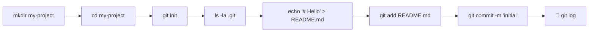

# 2️⃣ INIT — YOUR FIRST REPOSITORY

---

⏱️ **Time:** ~5 min | 🏁 **TL;DR:** `mkdir` → `cd` → `git init` → create a file → `git add` → `git commit` → `git log`. That's it.

---

## 🔁 LAST TIME...

In [01-setup.md](01-setup.md), you installed git and set your name/email with `git config --global`.

---

## 🚀 THE EXACT STEPS



```bash
mkdir ~/first-repo
cd ~/first-repo
git init                          # "Initialized empty Git repository..."
ls -la .git                       # See git's brain: config, HEAD, objects/, refs/
echo "# My Repo" > README.md
git add README.md                 # Stage the file
git commit -m "chore: initial"    # Save the snapshot
git log --oneline                 # → abc1234 (HEAD -> main) chore: initial
```

📌 **`git init` once per project. The `.git` folder IS the repository.**

---

## ↪️ .mailmap — Fix Duplicate Authors

```bash
echo "Alice Smith <alice@company.com> <alice@personal.com>" > .mailmap
git add .mailmap && git commit -m "chore: add mailmap"
```

---

## 📁 .gitkeep — Track Empty Dirs

Git doesn't track empty directories. Use `.gitkeep` convention:

```bash
mkdir -p src/logs
touch src/logs/.gitkeep
git add src/logs/.gitkeep
```

---

## 🧠 KEY TAKEAWAYS

- **`git init`** creates a new repository in the current directory
- **`.git/`** stores all history — delete it and it's gone forever
- **`echo > file` → `git add` → `git commit`** is the universal first-commit pattern
- **`.mailmap`** deduplicates author names across email changes
- **`.gitkeep`** is a convention (not a git feature) to track empty directories

---

> **Next: [03-core-loop.md](03-core-loop.md) — The commands you'll use 90% of the time**
