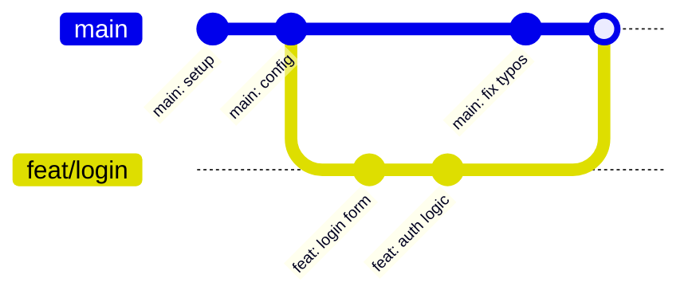

# 8️⃣ BRANCH MANAGEMENT

⏱️ **Time:** ~10 min | 🏁 **TL;DR:** Branches = alternate realities. `git switch -c name` creates + switches. `git branch -d/-D` deletes. `git log --oneline --graph --all` visualizes.

## 🔁 LAST TIME...

In [07-rm-mv.md](../07-rm-mv.md), you learned about undoing changes. **Today:** Parallel universes.

## What IS a Branch?



👉 **Mnemonic:** Branches = **"Alternate realities where you can't break the main timeline."**

## `git branch` — List, Create, Delete

```bash
git branch          # List branches (* = current)
git branch -v       # List with last commit
git branch -vv      # List with merge status
git branch -d name  # Delete (safe — refuses if unmerged)
git branch -D name  # Delete (force)
git branch -m old new  # Rename
```

## `git switch` (preferred) vs `git checkout`

```bash
git checkout main          # OLD — does too many things
git checkout -b new-feat   # OLD: create + switch

git switch main            # NEW: switch
git switch -c new-feat     # NEW: create + switch
git switch -               # NEW: previous branch
```

💡 **Always prefer `git switch`** — more specific and safer.

## Visualizing Branches

```bash
git log --oneline --graph --all --decorate
# Alias: git config --global alias.tree "log --oneline --graph --all --decorate"
```

## 🧠 KEY TAKEAWAYS

- **Branches = parallel timelines** — experiment without breaking `main`
- **`git switch -c name`** = create + switch in one command
- **`git switch -`** jumps back to your previous branch
- **`git branch -d`** is safe; **`-D`** force-deletes unmerged branches
- **`git log --oneline --graph --all`** shows the full branch topology

**Next: [09-merge.md](09-merge.md)** — Merging and conflicts
