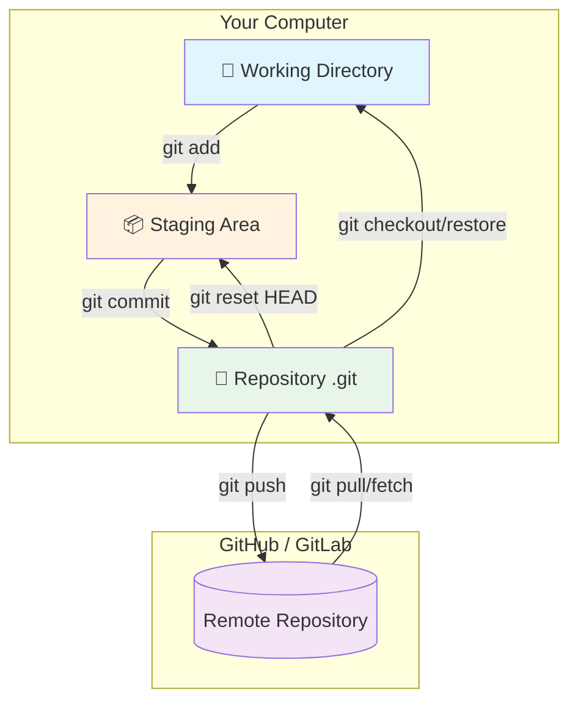

# 🦋 GIT: ABSOLUTE ZERO → MENACE
### The Modular, Multi-Sensory, Nothing-Missing Guide

---

## 🚀 SPRINT MODE — You Have 2 Minutes

```bash
# The ONLY 10 commands you need to survive:
git init                          # Start a repo
git add .                         # Stage everything
git commit -m "feat: message"     # Save snapshot
git status                        # What's happening?
git log --oneline --graph --all   # See the big picture
git switch -c branch-name         # Create + switch branch
git push -u origin HEAD           # Share your work
git pull --rebase                 # Get latest (safely)
git stash                         # Put aside messy work
git push --force-with-lease       # Fix remote (safely)
```

[⬇️ Download 1-page cheat sheet](cheatsheet.md)

---

## 📋 HOW THIS WORKS

| For you | Do this |
|---------|---------|
| 🧠 **ADHD — short attention span** | Open any file. Each is self-contained (30-70 lines). One topic per file. |
| 📋 **OCD — must know everything** | Follow the numbered path in order. Nothing is skipped. |
| 👂 **Auditory learner** | Read the **Stories**. They're real scenarios you'll remember. |
| 👁️ **Visual learner** | Look at the **Mermaid diagrams**. They render as real graphs. |
| ✋ **Kinesthetic learner** | Run the commands as you read. Learn by doing. |
| 🔁 **Forgetful** | Each file starts with **"Last time..."** — spaced repetition of previous concepts. |

---

## 📊 PROGRESS TRACKER

```
  🍼 ZERO  [ ] 00-what-is-git    — What Git IS (concept)
  ⚙️ SETUP  [ ] 01-setup          — Install & config
  🚀 INIT  [ ] 02-init            — First repo & commit
  🔄 LOOP  [ ] 03-core-loop       — add, commit, status
  📜 LOG   [ ] 04-log             — Viewing history
  🔍 DIFF  [ ] 05-diff            — Viewing changes
  🙈 IGNORE [ ] 06-ignore          — .gitignore
  🗑️ RM-MV [ ] 07-rm-mv           — Remove & rename
  🌿 BRANCH [ ] 08-branch          — Branch management
  🔀 MERGE  [ ] 09-merge           — Merging & conflicts
  ☁️ REMOTE [ ] 10-remote          — Push, pull, fetch, SSH
  🤝 TEAM  [ ] 11-collaboration   — Fork/PR & conventions
  ↩️ UNDO  [ ] 12-undo             — Fix mistakes
  📦 STASH [ ] 13-stash            — Shelve work
  🧹 REBASE [ ] 14-rebase           — Clean history
  🍒 CHERRY [ ] 15-cherry-pick     — Steal commits
  🏷️ TAG   [ ] 16-tag             — Version bookmarks
  🔬 INTERNALS [ ] 17-internals       — .git & objects
  🕰️ REFLOG [ ] 18-reflog           — Recover anything
  🎯 BISECT [ ] 19-bisect           — Find bugs
  🤖 HOOKS  [ ] 20-hooks            — Automate checks
  🛠️ TOOLS [ ] 21-advanced-tools   — Blame, grep, aliases
  🔥 FILTER [ ] 22-filter-repo      — Rewrite history
  🧹 MAINT [ ] 23-maintenance      — GC, worktree, submodule
  🏆 PRO   [ ] 24-pro              — Pro conventions
  🏭 WORKFLOWS [ ] 25-workflows      — Production-grade workflows
```

Copy this and replace `[ ]` with `[x]` as you finish each file.

---

## 🧭 LEARNING PATH


---

## 📐 VISUAL KEY

```
✅ = You did it right      ❌ = Common mistake      ⚠️ = Watch out!
💡 = Pro tip               🔑 = Key concept          🔥 = Advanced
📌 = Remember this         📝 = Try it               👉 = Mnemonic
```

---

## 🗺️ THE BIG PICTURE



---

## 📚 ALL FILES

| File | What's Inside |
|------|--------------|
| [`00-what-is-git.md`](00-what-is-git.md) | What git IS — three states, time machine analogy |
| [`01-setup.md`](01-setup.md) | Install, git config, config scopes |
| [`02-init.md`](02-init.md) | First repo: init, add, commit, .gitkeep, .mailmap |
| [`03-core-loop.md`](03-core-loop.md) | `add`, `commit`, `status` — the daily rhythm |
| [`04-log.md`](04-log.md) | `log` — oneline, graph, format, filters |
| [`05-diff.md`](05-diff.md) | `diff`, `show` — viewing changes |
| [`06-ignore.md`](06-ignore.md) | `.gitignore`, `check-ignore`, `update-index` |
| [`07-rm-mv.md`](07-rm-mv.md) | `rm`, `mv` — remove and rename tracked files |
| [`08-branch.md`](08-branch.md) | `branch`, `switch`, `checkout` |
| [`09-merge.md`](09-merge.md) | `merge`, conflicts, detached HEAD, `mergetool` |
| [`10-remote.md`](10-remote.md) | `clone`, `push`, `pull`, `fetch`, SSH, PAT, bare repos |
| [`11-collaboration.md`](11-collaboration.md) | Fork/PR, conventional commits, `gh`, `format-patch` |
| [`12-undo.md`](12-undo.md) | `restore`, `reset`, `revert`, `clean` — decision tree |
| [`13-stash.md`](13-stash.md) | `stash` — push, pop, list, branch, conflicts |
| [`14-rebase.md`](14-rebase.md) | `rebase`, `--onto`, `--autosquash`, `--exec` |
| [`15-cherry-pick.md`](15-cherry-pick.md) | `cherry-pick`, `range-diff`, `shortlog`, `merge-base` |
| [`16-tag.md`](16-tag.md) | `tag` — lightweight, annotated, signed, push/delete |
| [`17-internals.md`](17-internals.md) | `.git` structure, objects, plumbing, `rev-parse` |
| [`18-reflog.md`](18-reflog.md) | `reflog` — local activity log, recover anything |
| [`19-bisect.md`](19-bisect.md) | `bisect` — binary search for bugs |
| [`20-hooks.md`](20-hooks.md) | Git hooks — pre-commit, pre-push, `core.hooksPath` |
| [`21-advanced-tools.md`](21-advanced-tools.md) | `blame`, `grep`, `describe`, `notes`, aliases |
| [`22-filter-repo.md`](22-filter-repo.md) | `filter-repo` — erase secrets from history |
| [`23-maintenance.md`](23-maintenance.md) | `gc`, `fsck`, `bundle`, `sparse-checkout`, `worktree`, `submodule` |
| [`24-pro.md`](24-pro.md) | Branching strategies, commit rules, `.gitattributes` |
| [`25-workflows.md`](25-workflows.md) | Branch protection, signed commits, releases, GitOps, monorepo, backup |
| [`cheatsheet.md`](cheatsheet.md) | 1-page printable reference |
| [`troubleshooting.md`](troubleshooting.md) | Quick fixes for the 10 most common Git disasters |
| [`revision-sheet.md`](revision-sheet.md) | Everything at a glance — print and pin it |
| [`glossary.md`](glossary.md) | Git terms A–Z, one line each |
| [`examples.md`](examples.md) | Real-world before/after scenarios |
| [`INDEX.md`](INDEX.md) | Every command indexed to its file |

---

## 📖 STORIES

| Story | Who | What Happens | File |
|-------|-----|-------------|------|
| Alice's First Repo | 🧑 Alice | Sets up git, makes first commit | `02-init.md` |
| Bob's Accidental Main Commit | 👨 Bob | Forgot to branch, fixes with revert | `03-core-loop.md` |
| Carol's Merge Conflict | 👩 Carol | Two branches, same file, resolve conflict | `09-merge.md` |
| Dave's reset --hard Disaster | 🧔 Dave | `reset --hard` on wrong branch, reflog saves him | `12-undo.md` |
| Eve's Rebase --onto Triumph | 👩 Eve | Branch on wrong base, fixes with --onto | `14-rebase.md` |
| Frank's First Open Source PR | 🧑 Frank | Forks, syncs upstream, opens clean PR | `11-collaboration.md` |
| Grace's Reflog Rescue | 👩 Grace | Deleted branch, reflog recovers everything | `18-reflog.md` |

---

> **Start with [00-what-is-git.md](00-what-is-git.md)**
